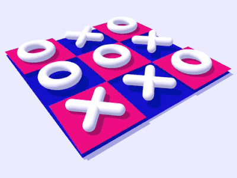
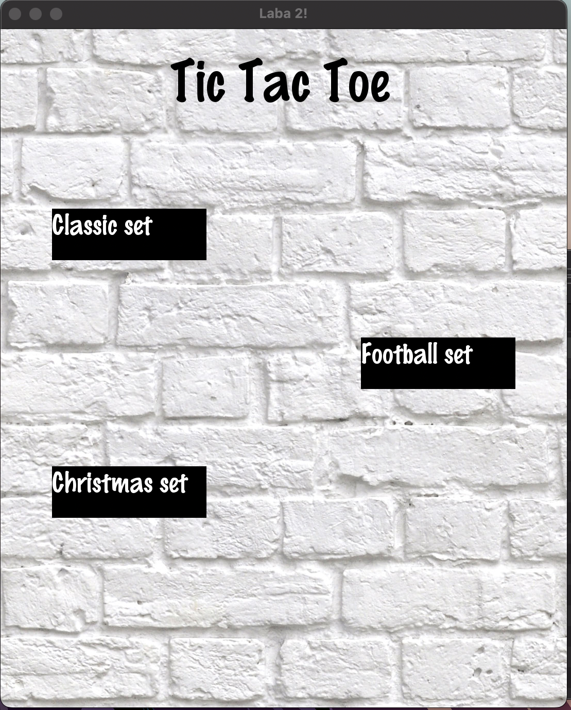
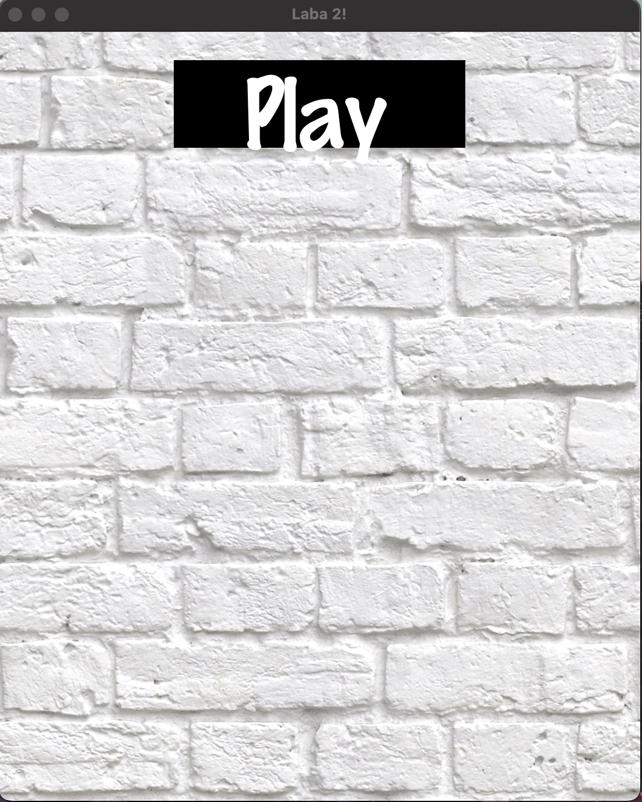
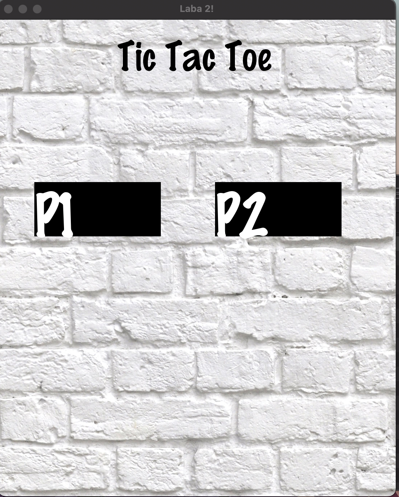
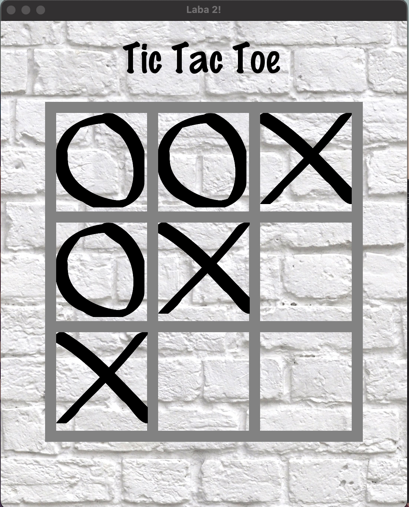
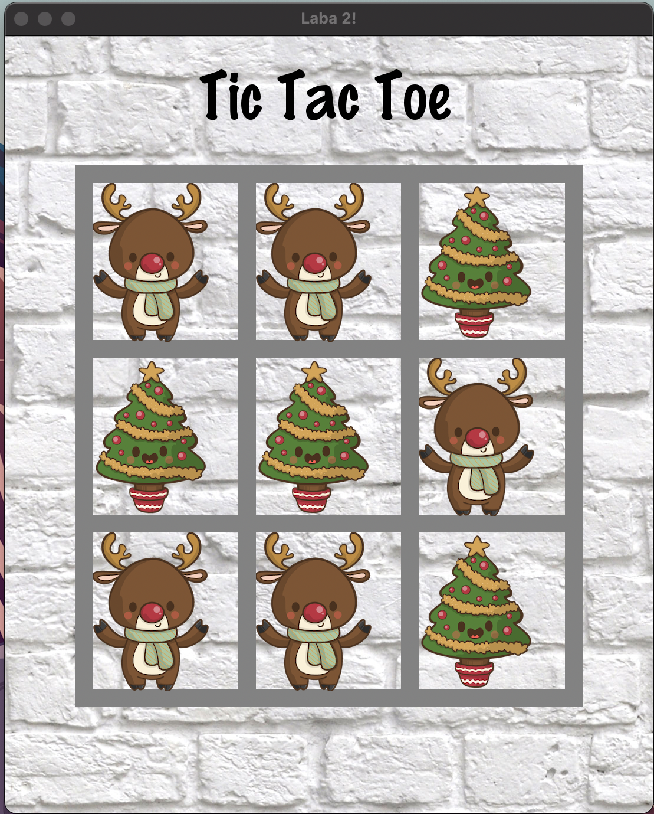
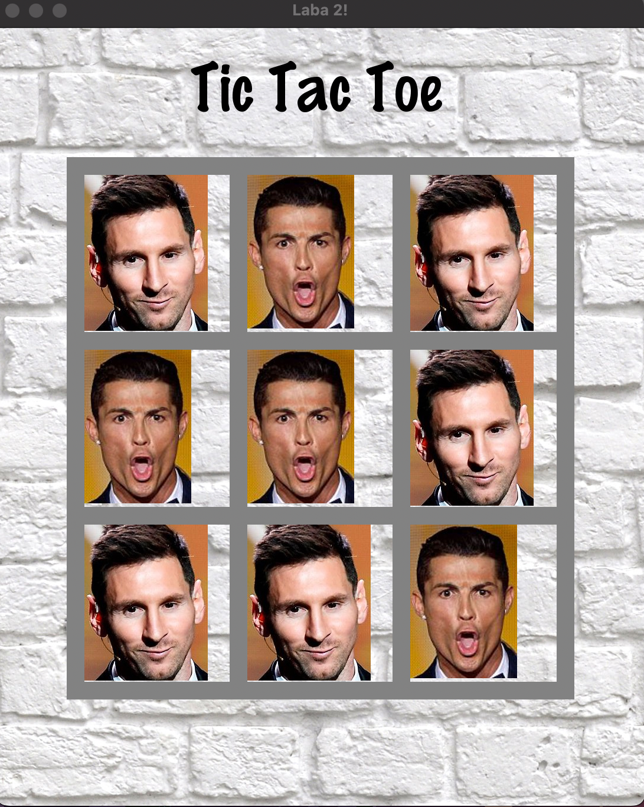

# Tic Tac Toe Game

This repository presents an implementation of the game Tic-Tac-Toe written in C++.
The specifics of my implementation is to use the minimax algorithm and use the alpha beta pruning method. In addition, this game has a very beautiful and unique graphical interface, written using SFML, with which you can choose one of 3 unique designs:
+ Football theme
+ Christmas theme
+ Classical theme

One of the most important features is that you can choose with which polymorphic abstract data types the game will be implemented:
+ Tree
+ Binary Tree 
+ Graph

## Game

### Rules
Tic-tac-toe is a logical game between two opponents on a square field of 3 by 3 cells or larger (up to an "infinite field"). One of the players plays with "crosses", the second — with "zeros". The traditional Chinese game uses black and white stones.

Players take turns placing signs on the free cells of the 3x3 field (one is always crosses, the other is always noughts). The first one who lines up 3 of his pieces vertically, horizontally or diagonally wins. The first move is made by the player putting crosses.

Usually, at the end of the game, the winning side crosses out its three signs (zeros or crosses), which make up a solid row.

### Minimax

Minimax (sometimes MinMax, MM[1] or saddle point[2]) is a decision rule used in artificial intelligence, decision theory, game theory, statistics, and philosophy for minimizing the possible loss for a worst case (maximum loss) scenario. When dealing with gains, it is referred to as "maximin" – to maximize the minimum gain. Originally formulated for several-player zero-sum game theory, covering both the cases where players take alternate moves and those where they make simultaneous moves, it has also been extended to more complex games and to general decision-making in the presence of uncertainty.

### Alpha Beta pruning

Alpha-beta pruning is a search algorithm that seeks to reduce the number of nodes evaluated in the search tree by the minimax algorithm. It is intended for antagonistic games and is used for machine games (in computer chess, computer go and others). The algorithm is based on the idea that the evaluation of a branch of the search tree can be terminated prematurely (without calculating all the values of the evaluating function) if it was found that for this branch the value of the evaluating function is in any case worse than that calculated for the previous branch. Alpha-beta clipping is an optimization, since it does not affect the correctness of the algorithm.

### Example of work GUI:

### Start

### Play

### Choose Player

### Choose Type of Board

### Classic Board
 

### Christmas Board
 

### Football Board
 